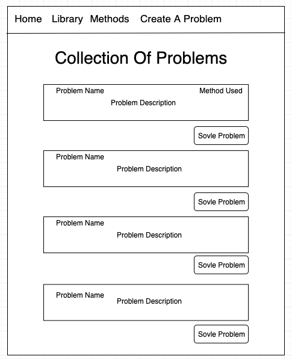
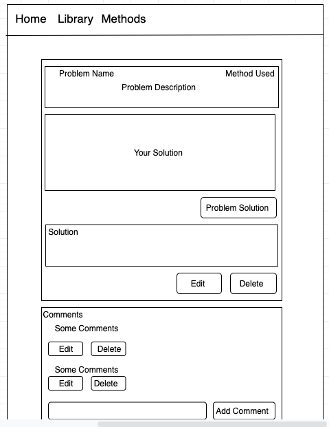
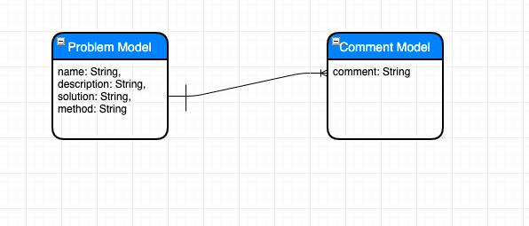

# PROJECT #3: Fundamental Coding

## Overview
For project #3, I choose to create a coding learning environment with simple challenges for people who want to learn basic coding. The users could solve the problems or create a problem which they can't sovle for others user's help. The answer are provided but recommend the users to try to solve it on their own. They could also leave the comments to ask more questions if they still don't understand the solutions for the problem.
## Technologies Used
    - Express
    - React
    - Node.Js
    - Mongo DB
    - Mongoose
    - JavaScript

## Dependencies:
    - Semantic Reacts UI
    - Ace Editor
    - Code Mirror2
    - Repl.it

## Links
- Project Planning:
<a href="https://trello.com/b/eUJNTdxM/fundamental-learning" target="_blank">Trello</a>
- Project Hosted:
<a href="https://fundamental-learning.herokuapp.com/" target="_blank">Heroku</a>

## Features
2 models:                           
- problem model           
- comment model 

2 controllers:   
- problem controller
- comment controller

## Future Improvements
- Create User Authentication
- Add user model for users problems collections
- Add testing feature to be able to counting points 

## Wireframe

## ERD
